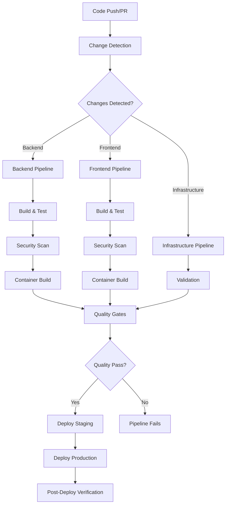

# CI/CD Pipeline Documentation

## Overview

The Workflow Orchestration Platform uses a comprehensive CI/CD pipeline built with GitHub Actions to ensure reliable, secure, and automated deployments. This documentation covers the complete pipeline architecture, configuration, and operational procedures.

## Quick Navigation

- [Getting Started](./getting-started.md) - Setup and first deployment
- [Pipeline Architecture](./pipeline-architecture.md) - Technical overview and design
- [Configuration Guide](./configuration.md) - Environment setup and secrets management
- [Security Guidelines](./security.md) - Security best practices and compliance
- [Troubleshooting](./troubleshooting.md) - Common issues and solutions
- [API Reference](./api-reference.md) - Pipeline APIs and webhooks

## Pipeline Features

### ✅ Automated Build & Test

- Multi-language support (.NET, TypeScript/React)
- Parallel pipeline execution for faster builds
- Comprehensive test suite with coverage reporting
- Code quality gates with SonarCloud integration

### 🛡️ Enterprise Security

- Container vulnerability scanning with Trivy
- Source code security analysis with CodeQL
- Container image signing with Cosign
- SBOM (Software Bill of Materials) generation

### 🚀 Deployment Automation

- Environment-specific deployments (staging/production)
- Kubernetes integration with Helm charts
- Automated rollback capabilities
- Health checks and deployment verification

### 📊 Monitoring & Observability

- Real-time pipeline metrics
- Deployment success/failure tracking
- Performance monitoring integration
- Comprehensive logging and audit trails

## Quick Start

### Prerequisites

- GitHub repository with appropriate permissions
- Kubernetes cluster access
- Container registry (GitHub Container Registry)
- SonarCloud account (optional but recommended)

### Basic Setup

1. **Configure Repository Secrets**

   ```bash
   # GitHub repository secrets required:
   SONAR_TOKEN=your_sonarcloud_token
   KUBECONFIG=your_kubernetes_config
   ```

2. **Enable GitHub Actions**
   - Ensure GitHub Actions is enabled for your repository
   - Configure branch protection rules for main/develop branches

3. **First Deployment**
   - Push code to a feature branch
   - Create pull request to trigger pipeline
   - Merge to main for production deployment

## Architecture Overview



## Pipeline Workflows

### Main Orchestration Pipeline

- **File**: `.github/workflows/main.yml`
- **Triggers**: Push to main/develop/feature branches, Pull requests
- **Purpose**: Orchestrates the entire CI/CD process

### Backend Pipeline

- **File**: `.github/workflows/backend.yml`
- **Purpose**: .NET application build, test, and containerization
- **Features**: Unit testing, integration testing, security scanning

### Frontend Pipeline

- **File**: `.github/workflows/frontend.yml`
- **Purpose**: Next.js application build, test, and containerization
- **Features**: TypeScript checking, linting, testing, bundle optimization

### Deployment Pipeline

- **File**: `.github/workflows/deploy.yml`
- **Purpose**: Kubernetes deployment with Helm
- **Features**: Environment-specific deployments, health checks, rollback

## Key Benefits

### For Developers

- **Fast Feedback**: Parallel pipelines reduce build times by 60%
- **Quality Assurance**: Automated testing and code quality checks
- **Easy Debugging**: Comprehensive logging and error reporting
- **Security**: Built-in security scanning and vulnerability detection

### For Operations

- **Reliability**: Automated deployments with rollback capabilities
- **Observability**: Complete audit trail and monitoring
- **Scalability**: Supports multiple environments and deployment strategies
- **Compliance**: Security scanning and SBOM generation for compliance

### For Business

- **Faster Time to Market**: Automated deployments enable rapid releases
- **Risk Reduction**: Comprehensive testing and security scanning
- **Cost Efficiency**: Optimized resource usage and automated processes
- **Quality**: Consistent, repeatable deployment processes

## Next Steps

1. [Set up your development environment](./getting-started.md)
2. [Configure pipeline secrets and environment variables](./configuration.md)
3. [Review security guidelines](./security.md)
4. [Deploy your first application](./getting-started.md#first-deployment)

## Support

- **Documentation Issues**: Create an issue in the repository
- **Pipeline Support**: Contact the DevOps team
- **Security Questions**: Reach out to the security team
- **General Questions**: Use the team Slack channel

---

*Last updated: July 19, 2025*
*Version: 1.0*
