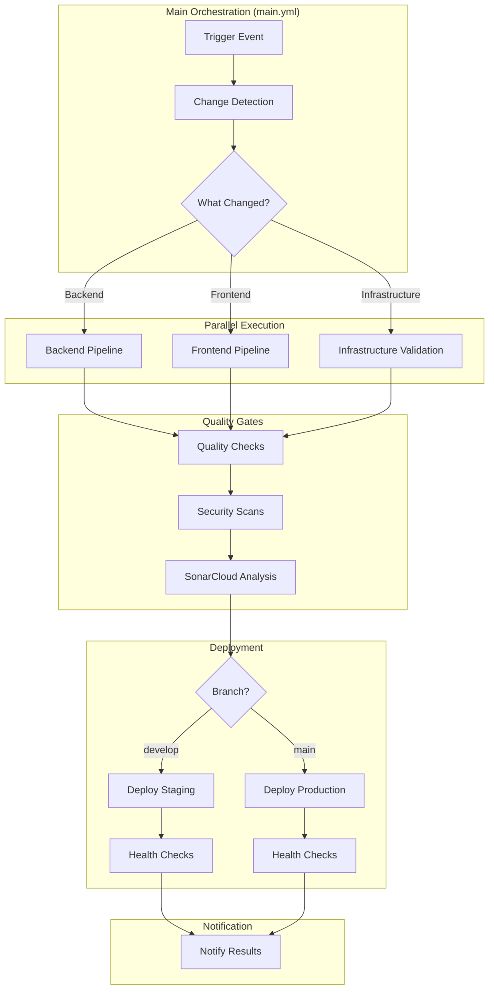
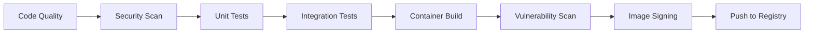
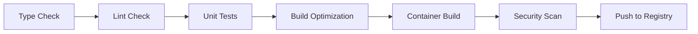
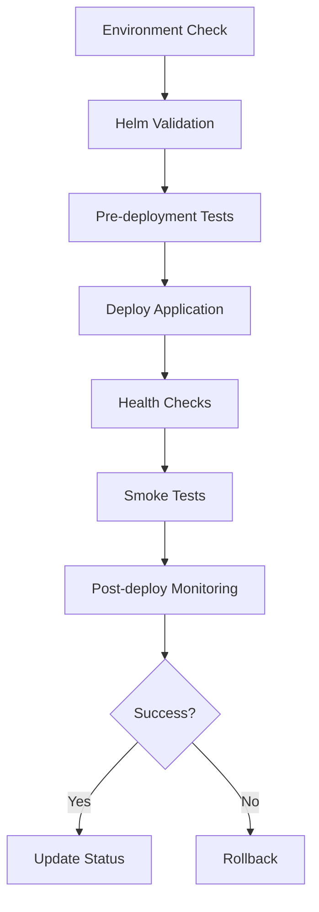
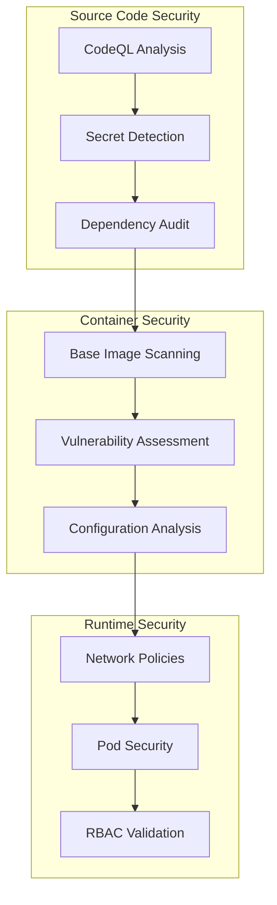
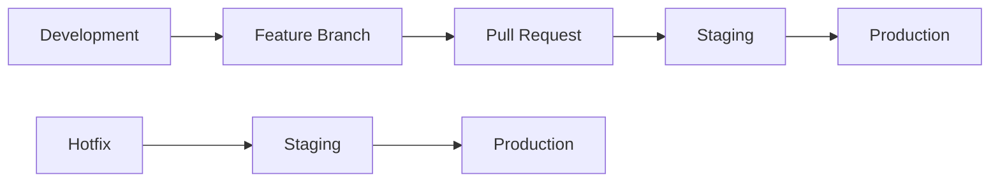

# Pipeline Architecture

## Overview

The Workflow Orchestration Platform CI/CD pipeline is built using GitHub Actions with a modular, reusable workflow architecture. This design enables efficient parallel execution, comprehensive quality gates, and secure deployment processes.

## Architecture Principles

### 1. Modular Design

- **Separation of Concerns**: Each workflow has a specific responsibility
- **Reusability**: Common workflows can be called from multiple places
- **Maintainability**: Changes to one workflow don't impact others

### 2. Parallel Execution

- **Performance**: Backend and frontend pipelines run concurrently
- **Resource Efficiency**: Optimal use of GitHub Actions runners
- **Fast Feedback**: Developers get results quickly

### 3. Security First

- **Multiple Scanning Layers**: Code, container, and dependency scanning
- **Least Privilege**: Minimal required permissions for each step
- **Secret Management**: Secure handling of sensitive information

## Workflow Structure



## Workflow Details

### Main Orchestration Workflow

**File**: `.github/workflows/main.yml`

**Purpose**: Central coordinator for all CI/CD activities

**Responsibilities**:

- **Trigger Management**: Handles push events, pull requests, and manual triggers
- **Change Detection**: Analyzes file changes to determine which pipelines to execute
- **Job Orchestration**: Coordinates backend, frontend, and deployment workflows
- **Quality Gates**: Ensures all quality checks pass before deployment
- **Notification**: Reports pipeline status and results

**Triggers**:

```yaml
on:
  push:
    branches: [main, develop, 'feature/*', 'hotfix/*']
  pull_request:
    branches: [main, develop]
  workflow_dispatch:
    inputs:
      force_backend:
        description: 'Force backend pipeline execution'
        type: boolean
        default: false
      force_frontend:
        description: 'Force frontend pipeline execution'  
        type: boolean
        default: false
```

**Change Detection Logic**:

```yaml
filters: |
  backend:
    - 'src/**'
    - 'tests/**'
    - '*.sln'
    - 'Directory.Build.props'
    - 'docker/backend/**'
    - 'src/WorkflowPlatform.API/Dockerfile'
  frontend:
    - 'workflow-platform-frontend/**'
    - 'docker/frontend/**'
  infrastructure:
    - 'helm/**'
    - 'k8s/**'
    - 'docker-compose*.yml'
    - '.github/workflows/**'
```

### Backend Pipeline

**File**: `.github/workflows/backend.yml`

**Purpose**: .NET application build, test, and containerization

**Architecture**:



**Key Features**:

- **Multi-stage Testing**: Unit tests, integration tests with real database
- **Code Quality**: Format checking, build validation, test coverage
- **Security Scanning**: Trivy for vulnerabilities, CodeQL for code analysis
- **Container Optimization**: Multi-stage Docker builds, layer caching
- **Supply Chain Security**: Image signing with Cosign, SBOM generation

**Performance Optimizations**:

```yaml
# Parallel test execution
strategy:
  matrix:
    test-group: [unit, integration, security]

# Docker layer caching
- name: Setup Docker Buildx
  uses: docker/setup-buildx-action@v3
  with:
    cache-from: type=gha
    cache-to: type=gha,mode=max
```

### Frontend Pipeline

**File**: `.github/workflows/frontend.yml`

**Purpose**: Next.js application build, test, and containerization

**Architecture**:



**Key Features**:

- **TypeScript Validation**: Strict type checking with zero tolerance for errors
- **Code Quality**: ESLint with custom rules, Prettier formatting
- **Testing**: Jest unit tests, React Testing Library integration tests
- **Build Optimization**: Bundle analysis, code splitting, tree shaking
- **Performance**: Lighthouse CI for performance regression detection

**Bundle Analysis**:

```yaml
- name: Analyze Bundle
  run: |
    npm run build:analyze
    npm run bundle-analyzer
  env:
    ANALYZE: true
```

### Deployment Pipeline

**File**: `.github/workflows/deploy.yml`

**Purpose**: Kubernetes deployment with Helm charts

**Architecture**:



**Deployment Strategy**:

- **Blue-Green Deployments**: Zero-downtime deployments with instant rollback
- **Health Monitoring**: Comprehensive readiness and liveness probes
- **Gradual Rollout**: Staged deployment with traffic shifting
- **Automatic Rollback**: Rollback on health check failures

**Environment Configuration**:

```yaml
# Staging Environment
environment: staging
values-file: values-staging.yaml
namespace: workflow-platform-staging
replicas: 2
resources:
  requests:
    memory: "512Mi"
    cpu: "500m"

# Production Environment  
environment: production
values-file: values-production.yaml
namespace: workflow-platform
replicas: 5
resources:
  requests:
    memory: "1Gi"
    cpu: "1000m"
```

## Security Architecture

### Multi-Layer Security Scanning



### Security Tools Integration

**CodeQL**: Advanced semantic code analysis

```yaml
- name: Initialize CodeQL
  uses: github/codeql-action/init@v3
  with:
    languages: csharp, typescript
    queries: security-and-quality
```

**Trivy**: Container and dependency vulnerability scanning

```yaml
- name: Run Trivy Scanner
  uses: aquasecurity/trivy-action@master
  with:
    scan-type: 'fs'
    scan-ref: '.'
    format: 'sarif'
    output: 'trivy-results.sarif'
```

**Cosign**: Container image signing

```yaml
- name: Sign Container Image
  uses: sigstore/cosign-installer@v3
- name: Sign image with Cosign
  run: |
    cosign sign --yes ${{ env.REGISTRY }}/${{ env.IMAGE_NAME }}:${{ github.sha }}
```

## Performance Optimizations

### Build Performance

**Parallel Execution**: Multiple jobs run concurrently

```yaml
strategy:
  matrix:
    include:
      - job: backend
        runner: ubuntu-latest
      - job: frontend  
        runner: ubuntu-latest
      - job: tests
        runner: ubuntu-latest
```

**Caching Strategy**: Aggressive caching at multiple levels

```yaml
# Dependencies caching
- uses: actions/cache@v4
  with:
    path: ~/.nuget/packages
    key: ${{ runner.os }}-nuget-${{ hashFiles('**/*.csproj') }}

# Docker layer caching
- uses: docker/setup-buildx-action@v3
  with:
    cache-from: type=gha
    cache-to: type=gha,mode=max
```

### Resource Optimization

**Runner Selection**: Appropriate runner sizes for different jobs

```yaml
jobs:
  lightweight-tasks:
    runs-on: ubuntu-latest        # 2 cores, 7GB RAM
    
  heavy-compilation:
    runs-on: ubuntu-latest-4-cores # 4 cores, 16GB RAM
    
  security-scanning:
    runs-on: ubuntu-latest-8-cores # 8 cores, 32GB RAM
```

**Conditional Execution**: Skip unnecessary work

```yaml
if: |
  needs.changes.outputs.backend == 'true' || 
  github.event_name == 'workflow_dispatch' && 
  inputs.force_backend
```

## Monitoring and Observability

### Pipeline Metrics

**Success Rate Tracking**:

```yaml
- name: Record Pipeline Metrics
  run: |
    curl -X POST "https://metrics.company.com/api/pipeline" \
      -H "Content-Type: application/json" \
      -d '{
        "pipeline": "${{ github.workflow }}",
        "status": "${{ job.status }}",
        "duration": "${{ steps.timer.outputs.duration }}",
        "commit": "${{ github.sha }}"
      }'
```

**Performance Monitoring**:

```yaml
- name: Performance Benchmark
  run: |
    echo "::set-output name=build-time::$(date -d @$(($(date +%s) - $START_TIME)) -u +%H:%M:%S)"
    echo "::set-output name=test-count::$(grep -c "Test passed" test-results.xml)"
```

### Alerting

**Failure Notifications**:

```yaml
- name: Notify on Failure
  if: failure()
  uses: 8398a7/action-slack@v3
  with:
    status: failure
    fields: repo,message,commit,author,action,eventName,ref,workflow
  env:
    SLACK_WEBHOOK_URL: ${{ secrets.SLACK_WEBHOOK_URL }}
```

## Deployment Environments

### Environment Strategy



### Environment Configuration

**Staging Environment**:

- **Purpose**: Pre-production validation, integration testing
- **Deployment**: Automatic on develop branch merge
- **Resources**: 2 replicas, 512Mi memory, 500m CPU
- **Data**: Synthetic test data, anonymized production subset

**Production Environment**:

- **Purpose**: Live user-facing application
- **Deployment**: Manual approval required, automatic on main branch
- **Resources**: 5 replicas, 1Gi memory, 1000m CPU
- **Data**: Live production data with full security

## Disaster Recovery

### Rollback Procedures

**Automatic Rollback**: Triggered by health check failures

```yaml
- name: Health Check
  run: |
    for i in {1..30}; do
      if curl -f https://${{ env.APP_URL }}/health; then
        echo "Health check passed"
        break
      fi
      if [ $i -eq 30 ]; then
        echo "Health check failed, initiating rollback"
        helm rollback ${{ env.RELEASE_NAME }} -n ${{ env.NAMESPACE }}
        exit 1
      fi
      sleep 10
    done
```

**Manual Rollback**: Available through GitHub Actions

```yaml
workflow_dispatch:
  inputs:
    environment:
      description: 'Environment to rollback'
      required: true
      type: choice
      options: [staging, production]
    revision:
      description: 'Helm revision to rollback to'
      required: true
      type: string
```

### Backup Verification

**Database Backup**: Automated before deployments

```yaml
- name: Create Database Backup
  run: |
    kubectl exec -n ${{ env.NAMESPACE }} deployment/postgres -- \
      pg_dump ${{ env.DB_NAME }} > backup-${{ github.sha }}.sql
    
    # Upload backup to secure storage
    aws s3 cp backup-${{ github.sha }}.sql s3://backups/database/
```

## Best Practices

### Workflow Design

1. **Keep workflows focused**: Each workflow should have a single responsibility
2. **Use reusable workflows**: Avoid duplication across workflows
3. **Implement proper error handling**: Fail fast with clear error messages
4. **Cache aggressively**: Cache dependencies, build artifacts, and Docker layers

### Security

1. **Least privilege principle**: Grant minimal required permissions
2. **Secret rotation**: Regularly rotate all secrets and tokens
3. **Audit logging**: Log all security-relevant events
4. **Vulnerability management**: Address critical vulnerabilities within 24 hours

### Performance

1. **Parallel execution**: Run independent jobs concurrently
2. **Conditional execution**: Skip unnecessary steps based on changes
3. **Resource optimization**: Use appropriate runner sizes
4. **Monitoring**: Track and optimize pipeline performance metrics

---

*Next: [Configuration Guide](./configuration.md)*
