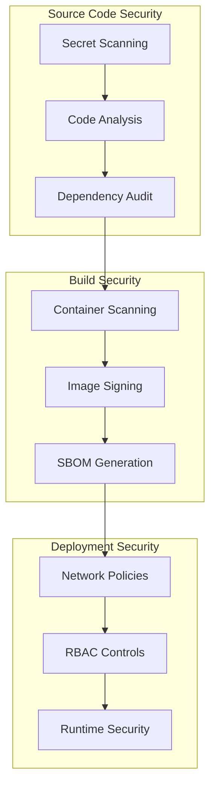

# Security Guidelines

## Overview

This document outlines the comprehensive security measures implemented in the CI/CD pipeline for the Workflow Orchestration Platform. These guidelines ensure enterprise-grade security throughout the development lifecycle.

## Security Architecture

### Multi-Layer Security Model



### Security Principles

1. **Zero Trust**: Never trust, always verify
2. **Defense in Depth**: Multiple security layers
3. **Least Privilege**: Minimal required permissions
4. **Secure by Default**: Security-first configuration
5. **Continuous Monitoring**: Real-time security validation

## Secret Management

### GitHub Secrets Security

#### Naming Convention

```bash
# Environment-specific secrets
{SERVICE}_{ENVIRONMENT}_{PURPOSE}
Examples:
- JWT_SECRET_PRODUCTION
- DB_PASSWORD_STAGING
- API_KEY_EXTERNAL_SERVICE_PROD
```

#### Secret Categories

**Critical Secrets** (Immediate rotation on compromise):

```bash
# Authentication & Authorization
JWT_SECRET_PRODUCTION="<256-bit-minimum-secret>"
JWT_SECRET_STAGING="<256-bit-minimum-secret>"

# Database Credentials
DB_PASSWORD_PRODUCTION="<complex-password>"
DB_CONNECTION_STRING_PRODUCTION="<full-connection-string>"

# External Service Keys
SENDGRID_API_KEY="<service-api-key>"
AZURE_CLIENT_SECRET="<azure-app-secret>"
```

**Infrastructure Secrets**:

```bash
# Kubernetes Access
KUBECONFIG_PRODUCTION="<base64-encoded-config>"
KUBECONFIG_STAGING="<base64-encoded-config>"

# Container Registry
GHCR_TOKEN="<github-container-registry-token>"
```

**Monitoring & Alerting**:

```bash
# Notification Services
SLACK_WEBHOOK_URL="<webhook-url>"
TEAMS_WEBHOOK_URL="<webhook-url>"

# Monitoring Services
GRAFANA_API_KEY="<monitoring-api-key>"
PROMETHEUS_TOKEN="<metrics-token>"
```

#### Secret Rotation Policy

**Automated Rotation** (Recommended):

```yaml
# .github/workflows/secret-rotation.yml
name: Secret Rotation

on:
  schedule:
    - cron: '0 0 1 */3 *'  # Quarterly rotation

jobs:
  rotate-secrets:
    runs-on: ubuntu-latest
    steps:
      - name: Rotate JWT Secrets
        run: |
          NEW_SECRET=$(openssl rand -base64 64)
          # Update secret in GitHub via API
          # Update secret in production environment
          # Validate new secret functionality
```

**Manual Rotation Checklist**:

- [ ] Generate new secure secret
- [ ] Update GitHub repository secret
- [ ] Update production configuration
- [ ] Verify application functionality
- [ ] Document rotation in security log
- [ ] Invalidate old secret

### Kubernetes Secret Management

#### External Secrets Integration

**Azure Key Vault** (Recommended for production):

```yaml
# k8s/external-secret.yaml
apiVersion: external-secrets.io/v1beta1
kind: ExternalSecret
metadata:
  name: workflow-platform-secrets
  namespace: workflow-platform
spec:
  refreshInterval: 15s
  secretStoreRef:
    name: azure-keyvault
    kind: SecretStore
  target:
    name: app-secrets
    creationPolicy: Owner
  data:
  - secretKey: jwt-secret
    remoteRef:
      key: workflow-platform-jwt-secret
  - secretKey: db-password
    remoteRef:
      key: workflow-platform-db-password
```

**Sealed Secrets** (Alternative approach):

```bash
# Install sealed secrets controller
kubectl apply -f https://github.com/bitnami-labs/sealed-secrets/releases/download/v0.18.0/controller.yaml

# Create sealed secret
echo -n mypassword | kubectl create secret generic mysecret --dry-run=client --from-file=password=/dev/stdin -o yaml | kubeseal -o yaml
```

## Container Security

### Base Image Security

**Distroless Images** (Recommended):

```dockerfile
# Production stage with minimal attack surface
FROM mcr.microsoft.com/dotnet/aspnet:8.0-alpine AS runtime

# Create non-root user
RUN addgroup -g 1001 -S appgroup && \
    adduser -u 1001 -S appuser -G appgroup

# Set security labels
LABEL \
    org.opencontainers.image.vendor="WorkflowPlatform" \
    org.opencontainers.image.title="Workflow API" \
    org.opencontainers.image.description="Workflow Orchestration Platform API" \
    org.opencontainers.image.source="https://github.com/company/WorkFlowOchestrator"

# Remove package manager and unnecessary tools
RUN apk del apk-tools && \
    rm -rf /var/cache/apk/* /tmp/*

# Use non-root user
USER appuser

# Security: Read-only root filesystem
ENV ASPNETCORE_ENVIRONMENT=Production
ENV DOTNET_SYSTEM_GLOBALIZATION_INVARIANT=1

# Health check
HEALTHCHECK --interval=30s --timeout=3s --start-period=5s --retries=3 \
    CMD curl -f http://localhost:8080/health || exit 1
```

### Image Scanning

**Trivy Security Scanning**:

```yaml
# .github/workflows/security-scan.yml
- name: Run Trivy Vulnerability Scanner
  uses: aquasecurity/trivy-action@master
  with:
    image-ref: '${{ env.REGISTRY }}/${{ env.IMAGE_NAME }}:${{ github.sha }}'
    format: 'sarif'
    output: 'trivy-results.sarif'
    severity: 'CRITICAL,HIGH,MEDIUM'
    exit-code: '1'  # Fail on critical vulnerabilities

- name: Upload Trivy Results
  uses: github/codeql-action/upload-sarif@v3
  with:
    sarif_file: 'trivy-results.sarif'
```

**Custom Security Policies**:

```yaml
# .trivyignore
# CVE exceptions with business justification
CVE-2023-12345  # False positive - not applicable to our use case
CVE-2023-67890  # Patched in next release - temporary acceptance

# Security policy configuration
--severity HIGH,CRITICAL
--ignore-unfixed
--format table
```

### Image Signing with Cosign

**Keyless Signing** (GitHub Actions):

```yaml
- name: Install Cosign
  uses: sigstore/cosign-installer@v3

- name: Sign Container Image
  run: |
    cosign sign --yes ${{ env.REGISTRY }}/${{ env.IMAGE_NAME }}:${{ github.sha }}
  env:
    COSIGN_EXPERIMENTAL: 1
```

**Verification in Deployment**:

```yaml
- name: Verify Image Signature
  run: |
    cosign verify \
      --certificate-identity-regexp="https://github.com/${{ github.repository }}" \
      --certificate-oidc-issuer="https://token.actions.githubusercontent.com" \
      ${{ env.REGISTRY }}/${{ env.IMAGE_NAME }}:${{ github.sha }}
```

## Source Code Security

### Static Application Security Testing (SAST)

**CodeQL Analysis**:

```yaml
# .github/workflows/codeql.yml
name: CodeQL Security Analysis

on:
  push:
    branches: [main, develop]
  pull_request:
    branches: [main]
  schedule:
    - cron: '0 6 * * 1'  # Weekly scan

jobs:
  analyze:
    runs-on: ubuntu-latest
    permissions:
      actions: read
      contents: read
      security-events: write

    strategy:
      matrix:
        language: ['csharp', 'typescript']

    steps:
    - name: Checkout repository
      uses: actions/checkout@v4

    - name: Initialize CodeQL
      uses: github/codeql-action/init@v3
      with:
        languages: ${{ matrix.language }}
        queries: security-extended,security-and-quality

    - name: Build Application
      run: |
        dotnet build --configuration Release

    - name: Perform CodeQL Analysis
      uses: github/codeql-action/analyze@v3
      with:
        category: "/language:${{matrix.language}}"
```

**SonarCloud Security Rules**:

```properties
# sonar-project.properties
sonar.projectKey=workflowplatform
sonar.organization=company-org

# Security-focused analysis
sonar.qualitygate.wait=true
sonar.security.hotspots.max=0
sonar.security.vulnerabilities.max=0

# Custom security rules
sonar.cs.ruleset=security-rules.xml
sonar.typescript.ruleset=security-rules.json

# Coverage requirements for security-critical code
sonar.coverage.minimum=85
```

### Dependency Security

**Automated Vulnerability Scanning**:

```yaml
# Backend dependency scanning
- name: .NET Vulnerability Scan
  run: |
    dotnet list package --vulnerable --include-transitive --format json > vulnerabilities.json
    
    # Check for critical vulnerabilities
    if jq -e '.vulnerabilities[] | select(.severity == "Critical")' vulnerabilities.json; then
      echo "Critical vulnerabilities found"
      exit 1
    fi

# Frontend dependency scanning  
- name: NPM Security Audit
  run: |
    npm audit --audit-level=moderate --format=json > npm-audit.json
    
    # Fail on high/critical vulnerabilities
    npm audit --audit-level=high
```

**Dependency Update Automation**:

```yaml
# .github/workflows/dependency-updates.yml
name: Dependency Security Updates

on:
  schedule:
    - cron: '0 0 * * 1'  # Weekly security updates

jobs:
  security-updates:
    runs-on: ubuntu-latest
    steps:
    - name: Update .NET Dependencies
      run: |
        dotnet list package --outdated --include-transitive --format json > outdated.json
        
        # Update packages with security vulnerabilities
        jq -r '.vulnerabilities[].packageName' vulnerabilities.json | while read package; do
          dotnet add package "$package"
        done

    - name: Update NPM Dependencies  
      run: |
        npm audit fix --force
        npm update
```

## Network Security

### Container Network Policies

**Kubernetes Network Policies**:

```yaml
# k8s/network-policy.yaml
apiVersion: networking.k8s.io/v1
kind: NetworkPolicy
metadata:
  name: workflow-platform-netpol
  namespace: workflow-platform
spec:
  podSelector:
    matchLabels:
      app: workflow-api
  policyTypes:
  - Ingress
  - Egress
  
  ingress:
  - from:
    - namespaceSelector:
        matchLabels:
          name: ingress-nginx
    ports:
    - protocol: TCP
      port: 8080
  
  egress:
  - to:
    - namespaceSelector:
        matchLabels:
          name: database
    ports:
    - protocol: TCP
      port: 5432
  - to: []  # Allow DNS
    ports:
    - protocol: UDP
      port: 53
```

### TLS Configuration

**Ingress TLS**:

```yaml
# k8s/ingress.yaml
apiVersion: networking.k8s.io/v1
kind: Ingress
metadata:
  name: workflow-platform-ingress
  annotations:
    nginx.ingress.kubernetes.io/ssl-redirect: "true"
    nginx.ingress.kubernetes.io/force-ssl-redirect: "true"
    cert-manager.io/cluster-issuer: "letsencrypt-prod"
    nginx.ingress.kubernetes.io/ssl-protocols: "TLSv1.2 TLSv1.3"
    nginx.ingress.kubernetes.io/ssl-ciphers: "HIGH:!aNULL:!MD5"
spec:
  tls:
  - hosts:
    - api.workflowplatform.com
    secretName: workflow-platform-tls
  rules:
  - host: api.workflowplatform.com
    http:
      paths:
      - path: /
        pathType: Prefix
        backend:
          service:
            name: workflow-api
            port:
              number: 8080
```

## Access Control & RBAC

### GitHub Repository Security

**Branch Protection Rules**:

```yaml
# Required for production branches
protection_rules:
  main:
    required_status_checks:
      - "Backend Pipeline"
      - "Frontend Pipeline"
      - "Security Scans"
      - "CodeQL Analysis"
    enforce_admins: true
    required_pull_request_reviews:
      required_approving_review_count: 2
      dismiss_stale_reviews: true
      require_code_owner_reviews: true
    restrictions:
      users: []
      teams: ["security-team", "senior-developers"]
```

**CODEOWNERS Configuration**:

```bash
# .github/CODEOWNERS

# Global security review
* @security-team

# Critical infrastructure
.github/workflows/* @devops-team @security-team
k8s/* @devops-team @security-team
helm/* @devops-team @security-team

# Security-sensitive code
src/WorkflowPlatform.API/Security/* @security-team
src/WorkflowPlatform.Infrastructure/Security/* @security-team

# Database migrations
src/WorkflowPlatform.Infrastructure/Migrations/* @database-team @security-team
```

### Kubernetes RBAC

**Service Account Security**:

```yaml
# k8s/rbac.yaml
apiVersion: v1
kind: ServiceAccount
metadata:
  name: workflow-api-sa
  namespace: workflow-platform
automountServiceAccountToken: false
---
apiVersion: rbac.authorization.k8s.io/v1
kind: Role
metadata:
  name: workflow-api-role
  namespace: workflow-platform
rules:
- apiGroups: [""]
  resources: ["configmaps", "secrets"]
  verbs: ["get", "list"]
- apiGroups: [""]
  resources: ["pods"]
  verbs: ["get", "list", "watch"]
---
apiVersion: rbac.authorization.k8s.io/v1
kind: RoleBinding
metadata:
  name: workflow-api-binding
  namespace: workflow-platform
roleRef:
  apiGroup: rbac.authorization.k8s.io
  kind: Role
  name: workflow-api-role
subjects:
- kind: ServiceAccount
  name: workflow-api-sa
  namespace: workflow-platform
```

## Compliance & Auditing

### Security Logging

**Comprehensive Audit Logging**:

```yaml
# Application security logging
- name: Configure Security Logging
  run: |
    # Enable security event logging
    export ASPNETCORE_ENVIRONMENT=Production
    export Logging__LogLevel__Security=Information
    
    # Log security events to centralized logging
    export Serilog__WriteTo__0__Name=Console
    export Serilog__WriteTo__1__Name=File
    export Serilog__WriteTo__1__Args__path=logs/security-.txt
    export Serilog__WriteTo__1__Args__rollingInterval=Day
    export Serilog__WriteTo__1__Args__retainedFileCountLimit=30
```

**Pipeline Security Audit**:

```yaml
- name: Security Audit Log
  run: |
    # Log all security-relevant pipeline events
    echo "$(date -u): Pipeline security audit started" >> security-audit.log
    echo "Commit: ${{ github.sha }}" >> security-audit.log
    echo "Actor: ${{ github.actor }}" >> security-audit.log
    echo "Event: ${{ github.event_name }}" >> security-audit.log
    
    # Upload to secure audit storage
    aws s3 cp security-audit.log s3://security-audit-logs/pipeline/
```

### Compliance Reporting

**SOC 2 Compliance**:

```yaml
# Automated compliance checks
- name: SOC 2 Compliance Check
  run: |
    # Check encryption in transit
    echo "Verifying TLS configuration..."
    testssl.sh --protocols --quiet ${{ env.APP_URL }}
    
    # Check access controls
    echo "Verifying access controls..."
    kubectl auth can-i create pods --as=system:serviceaccount:workflow-platform:workflow-api-sa
    
    # Check logging configuration
    echo "Verifying audit logging..."
    kubectl logs deployment/workflow-api | grep -q "Security audit enabled"
```

**GDPR Compliance**:

```yaml
- name: GDPR Data Protection Check
  run: |
    # Verify data encryption at rest
    kubectl get secrets -o jsonpath='{.items[*].metadata.name}' | grep -q "tls"
    
    # Check data retention policies
    kubectl get configmap data-retention-policy -o yaml
    
    # Verify data anonymization in logs
    kubectl logs deployment/workflow-api | grep -v "email\|ssn\|phone"
```

## Incident Response

### Security Incident Playbook

**Automated Incident Detection**:

```yaml
- name: Security Incident Detection
  run: |
    # Monitor for security indicators
    if grep -q "SECURITY_VIOLATION" application.log; then
      echo "Security violation detected"
      
      # Immediate response
      kubectl scale deployment workflow-api --replicas=0
      
      # Alert security team
      curl -X POST ${{ secrets.SLACK_SECURITY_WEBHOOK }} \
        -H 'Content-type: application/json' \
        --data '{"text":"SECURITY INCIDENT: Automatic shutdown initiated"}'
      
      exit 1
    fi
```

**Incident Response Automation**:

```yaml
name: Security Incident Response

on:
  repository_dispatch:
    types: [security-incident]

jobs:
  incident-response:
    runs-on: ubuntu-latest
    steps:
    - name: Emergency Shutdown
      run: |
        # Scale down affected services
        kubectl scale deployment workflow-api --replicas=0 -n workflow-platform
        
        # Isolate compromised resources
        kubectl patch networkpolicy default -p '{"spec":{"ingress":[]}}'
        
        # Collect forensic data
        kubectl logs deployment/workflow-api > incident-logs-${{ github.run_id }}.txt
        
        # Notify incident response team
        curl -X POST "${{ secrets.INCIDENT_WEBHOOK }}" \
          -H "Content-Type: application/json" \
          -d '{"severity": "critical", "type": "security", "run_id": "${{ github.run_id }}"}'
```

### Recovery Procedures

**Automated Recovery Validation**:

```yaml
- name: Security Recovery Validation
  run: |
    # Verify all vulnerabilities are patched
    trivy image ${{ env.REGISTRY }}/${{ env.IMAGE_NAME }}:${{ github.sha }} --exit-code 0
    
    # Validate security configurations
    kubectl auth can-i '*' '*' --as=system:serviceaccount:workflow-platform:workflow-api-sa | grep -q "no"
    
    # Test security controls
    curl -f https://${{ env.APP_URL }}/security/test
    
    # Restore normal operations
    kubectl scale deployment workflow-api --replicas=3
```

## Security Monitoring

### Real-time Security Monitoring

**Falco Integration** (Runtime Security):

```yaml
# k8s/falco-rules.yaml
- rule: Unexpected Network Activity
  desc: Detect unexpected network connections
  condition: >
    (inbound_outbound) and
    (fd.typechar = 4 or fd.typechar = 6) and
    (ka.target.resource = "workflow-api") and
    not proc.name in (allowed_processes)
  output: >
    Unexpected network activity
    (command=%proc.cmdline connection=%fd.name user=%user.name)
  priority: WARNING
  tags: [network, security]
```

**Prometheus Security Metrics**:

```yaml
# Collect security metrics
- name: Export Security Metrics
  run: |
    # Authentication failures
    echo "auth_failures_total $(grep 'Authentication failed' app.log | wc -l)" > metrics.prom
    
    # Security scan results
    echo "vulnerability_count_total $(jq '.vulnerabilities | length' scan-results.json)" >> metrics.prom
    
    # TLS certificate expiry
    echo "tls_cert_expiry_days $((($(date -d "$(openssl x509 -enddate -noout -in cert.pem | cut -d= -f 2)" +%s) - $(date +%s))) / 86400))" >> metrics.prom
```

## Best Practices

### Development Security

1. **Secure Coding Standards**
   - Input validation and sanitization
   - Output encoding
   - Parameterized queries
   - Error handling without information disclosure

2. **Security Testing**
   - Unit tests for security functions
   - Integration tests with security scenarios
   - Penetration testing for critical paths

3. **Code Review Security**
   - Security-focused code reviews
   - Automated security scanning in PRs
   - Security team involvement in critical changes

### Operational Security

1. **Infrastructure Security**
   - Regular security patching
   - Network segmentation
   - Monitoring and alerting
   - Incident response procedures

2. **Access Management**
   - Principle of least privilege
   - Regular access reviews
   - Multi-factor authentication
   - Session management

3. **Data Protection**
   - Encryption at rest and in transit
   - Data classification and handling
   - Backup security
   - Data retention policies

---

*Next: [Troubleshooting](./troubleshooting.md)*
